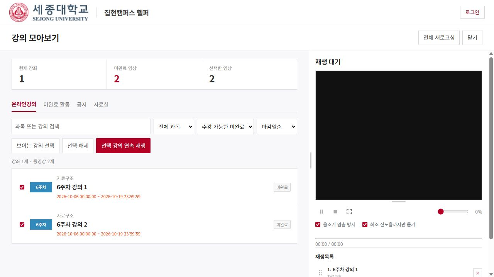

# 집현캠퍼스 헬퍼

세종대학교 집현캠퍼스의 강의, 공지와 자료를 한곳에서 확인하는 Chrome 확장 프로그램입니다. 편리한 강의 시청을 위한 연속 재생, 플레이리스트, 볼륨 유지 기능을 지원합니다.

## 설치

1. 압축을 **계속 보관할 위치**에 풀어주세요.
2. Chrome 주소창에 `chrome://extensions`를 입력하세요.
3. 오른쪽 위 **개발자 모드**를 켜세요.
4. **압축해제된 확장 프로그램을 로드합니다**를 누르고, 압축을 푼 곳의 **extension 폴더**를 선택하세요.
5. [집현캠퍼스](https://ecampus.sejong.ac.kr/login.php)에 본인 계정으로 로그인하세요.
6. 학교 페이지를 새로고침하고 **강의 모아보기**를 누르세요. Chrome의 확장 아이콘으로도 열 수 있습니다.

업데이트했을 때는 확장 관리 화면에서 헬퍼의 새로고침 버튼을 누르고 학교 페이지도 새로고침하세요.

## 사용

시청할 강의를 선택해 재생목록을 만들면 순서대로 재생됩니다. 활동·공지·자료실은 각각의 탭에서 확인할 수 있습니다.

**음소거 멈춤 방지**는 기본으로 켜져 있습니다. 켜진 상태에서 볼륨이 0%이면 영상 내부 볼륨을 1%로 두고 Chrome 탭을 음소거해 실제 소리가 나지 않게 합니다. 끄면 영상 자체를 음소거합니다.

완료한 영상도 **완료 영상** 또는 **전체 영상** 필터에서 선택해 복습할 수 있습니다.

**최소 진도율까지만 듣기**는 기본으로 켜져 있습니다. 완료한 영상은 건너뛰고, 미완료 영상은 학교 출석부의 요구시간을 충족해 출석·완료 반영이 확인되면 다음 강의로 넘어갑니다. 끄면 완료 여부와 관계없이 끝까지 재생합니다. 출석 기준을 확인할 수 없는 강의도 끝까지 재생합니다.

설치 후에도 **extension 폴더는 보관해주세요.** Chrome이 해당 폴더를 사용합니다.

## 작동 방식

로그인된 집현캠퍼스 페이지의 정보를 모아 보여주고, 학교의 기존 영상 플레이어로 강의를 재생합니다. 학교의 출석·완료 반영을 확인해 다음 강의로 넘어가며, 출석·진도를 임의로 변경하지 않습니다.

[세종대학교 2026-1학기 수강편람](https://www.sejong.ac.kr/kor/intro/notice3.do?articleNo=862579&attachNo=232292&mode=download)의 23쪽에는 본교 e-러닝 강의의 출석 기준으로 80% 이상 수강과 콘텐츠별 학습 인정 시간이 안내되어 있습니다. 헬퍼는 영상 길이의 80%를 일괄 적용하지 않고 실제 출석부의 기준을 확인합니다.

## 이용 안내

세종대학교의 공식 프로그램이 아닌 개인 제작 도구입니다. 출석 반영과 학교의 이용 정책은 직접 확인해주세요. **사용으로 발생한 문제에 대해 제작자는 책임을 지지 않습니다.**
